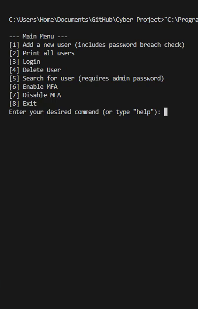
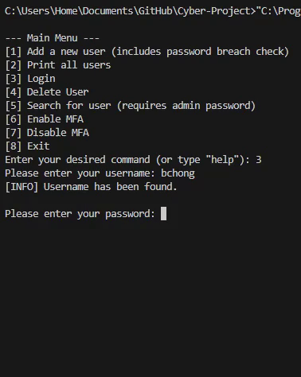

# Cybersecurity CLI Project
*A Python CLI exploring authentication, encryption, and password security*  

## 📖 Overview

This project explores core cybersecurity concepts through a Python-based command line interface. It simulates user account management with features such as:

- Multi-factor authentication (MFA) with QR codes and authenticator apps

- Password hashing and verification using bcrypt and SHA-1 breach check

- Data encryption/decryption with Fernet and salt

- Account lockout system after repeated failed logins

The goal of this project was to deepen my understanding of security principles while improving logic and coding skills.

## 🚀 Features
- User Management – Create, delete, search, and list users

- Authentication – Login with password and optional MFA

- Password Security – Hashing with bcrypt, breach check using SHA-1 and K-anonymity API

- Encryption – Sensitive data encrypted locally with Fernet

- Lockout – Temporary lock after multiple failed login attempts
## 🔧 How To Run/Use:

1. **Install Dependencies:** 
Make sure python is installed and install all of the libraries that are covered in the requirements.txt. Use pip install -r requirements.txt

2. **Run the Program:** python cli.py

3. **Example usage:**

  
*Creating a new user*  

## ⚠️ Known Limitations:

- ❌ Does not support undoing actions (Ctrl + C required)
- ⚠️ MFA enable/disable does not require password
- ⚠️ Key stored locally
- ❌ Not production ready
- Console only

## 🛠 Tech Stack
- Python
- bcrypt - password hashing
- cryptography(Fernet) - encryption/decryption
- requests - API calls for password breach checking

## 📝 Reflection  
This project strengthened my understanding of core cybersecurity practices and improved my Python skills.  
I explored authentication, hashing, and encryption concepts that gave me a clearer idea of whether I’d like to pursue cybersecurity further.

## License
This project is licensed under the [MIT License](LICENSE).
