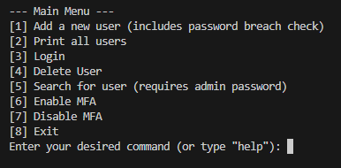
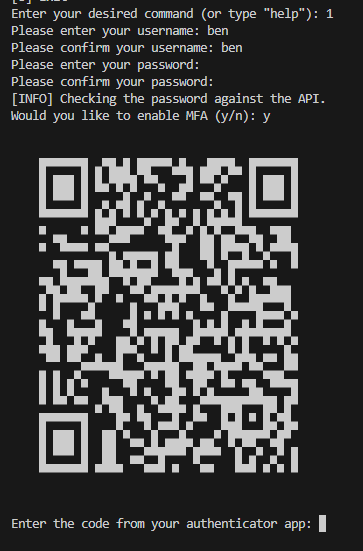
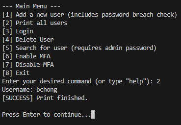
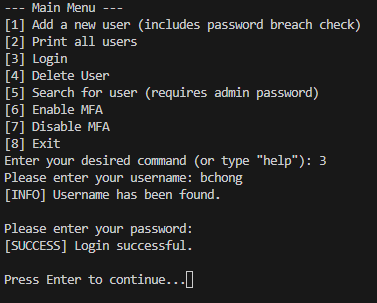
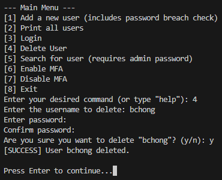
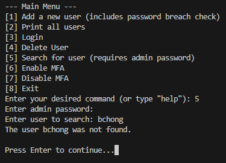
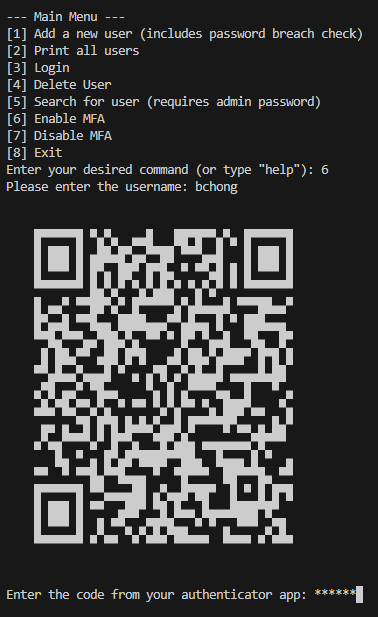
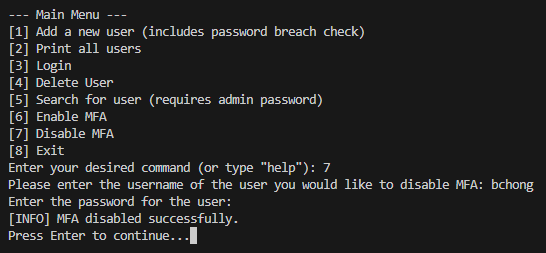
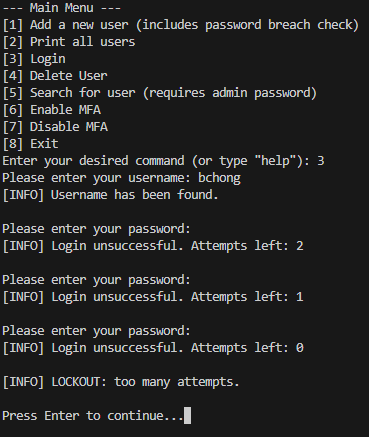
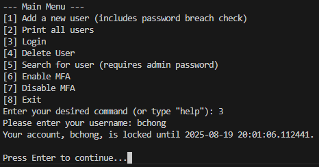

Project Goals:

The purpose of this project was to explore concepts of cybersecurity while also improving on my logic and coding skills. I was originally unsure if I wanted to pursue cybersecurity. So I decided to explore more cyber focused concepts like multi-factor authentication, hashing, and encryption. In addition, my goal was to better understand how these security measures are applied in real systems and to challenge myself with a security focused project.

How To Run/Use:

1. Install Dependencies: Make sure python is installed and install all of the libraries that are covered in the requirements.txt

2. Run the Program: python cli.py

3. Example usage:

i. 

Upon running the cli.py file, you will be greeted by the main menu where you will be able to choose from a variety of actions. We will go through each option.

ii. 

If you decide to choose the first option, it will ask you to add your user to the database. It will require a few things: 1. A valid username 2. a valid password 3. 'y/n' depending if you want to enable MFA. (You will need a phone if you decide you want to enable MFA) Once you put in your username and your password twice, you will have the option to enable MFA. If you do you will need your authenticator app and once you scan the qr code, it will require you type in the password on your screen. If both match, then it will be enabled. Going forward, you will need that code every time you log in.

iii. 

For this example I have myself as the only user. As more users are added to the database, more will be printed out.

iv. 

For this example, I am logging into my own account which does not have MFA enabled (I will show enabling later). All you need to do is have your username and password. 

v. 

When deleting someone from the database, you will need your username and your password. You will not need MFA even if you have it enabled.

vi. 

Searching for one individual person will require the admin password. If the user is found it will return that the user was indeed found. If the user does not exist (used in the example image), it will return 'The user ____ was not found'

vii. 

When enabling MFA, you will need to enter your username and once the username is found, you will need your phone to scan the QR code which should give you a six digit code. Once you have that code, you will need to enter that into the terminal. If both match, then you will have it successfully enabled.

viii. 

In this example, you can see that disabling MFA is very fast and you only need your username and your password.

ix. 

Here you can see that a lockout occurs if too many incorrect attempts are tried.

!

The lockout is enforced if you try to login during the time that it is locked.

Security Features Explained:

During this project, I learned about hashing, encryption, and lockout systems. For hashing, I implemented hashing in order to protect users passwords using bcrypt. In order to check it in the breach using the k-anomity API, I had to hash the passwords from the user using SHA-1 where I would then compare it against the API. For encryption, I learned about fernet and salt. The fernet essentially is the key that allows us as coder to decrypt and encrypt data. The salt is the randomly generated funciton that changes the code. 

Known Limitations:

- Does not support undoing actions. You have to use Ctrl + C
- MFA enable or disable does not use password at all
- Key stored locally
- Not production ready
- Console Only